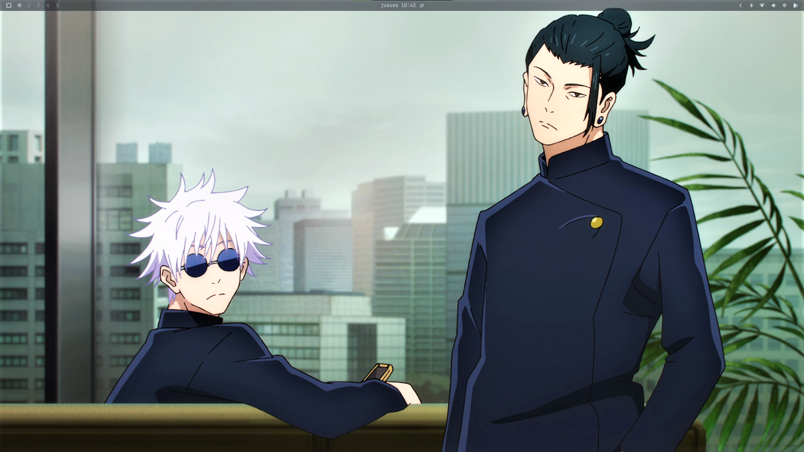

# Pure-Latin Theme for Omarchy v2.0

A complete, high-productivity theme for the Omarchy Arch Linux remix. Built on a foundation of deep blue-greys and subtle, cool-toned accents for a professional, low-contrast, and eye-friendly visual experience.

Created by Daury Dicaprio (daurydicaprio.com) | Official Omarchy Website: omarchy.org

## ✨ Key Features (v2.0)

*   **Cohesive Palette:** Consistent application of the cool blue-grey scheme across all components.
*   **Optimal Contrast:** High-contrast selection in Walker (Launcher) and Btop (System Monitor).
*   **Sharp Geometry:** Tiling windows maintain a clean, professional, and square aesthetic.
*   **Complete Integration:** Styles Hyprland, Waybar, Walker, Mako, Btop, Alacritty, and Kitty.
*   **Dynamic Elements:** Includes custom animations for a fluid desktop experience.

## 🎨 Color Palette (Core)

| Role | Hex |
| :--- | :--- |
| Background | \#262A33 |
| Foreground | \#D3DEE9 |
| Subtle Accent | \#333842 |
| Primary Accent | \#5E81AC |

## 🖼️ Screenshots



## 🚀 Quick Installation

Use the built-in Omarchy theme installer. Open a terminal and run:

```bash
omarchy-theme-install https://github.com/daurydicaprio/omarchy-pure-latin-theme
```

After installation, select **pure-latin** from the Omarchy theme menu (Super + Space -> Style -> Pick new theme).

## 📁 Live Wallpaper Support

This theme includes a dedicated folder structure for use with **Live Wallpaper Manager for Omarchy**.

To use live wallpapers, simply place your video files inside: `~/.config/omarchy/themes/pure-latin/backgrounds/live/`

[Get the Live Wallpaper Script Here](https://github.com/daurydicaprio/live-wallpaper-for-omarchy-linux)

## 📜 License

This project is licensed under the MIT License.

#VERyGoodforlife
