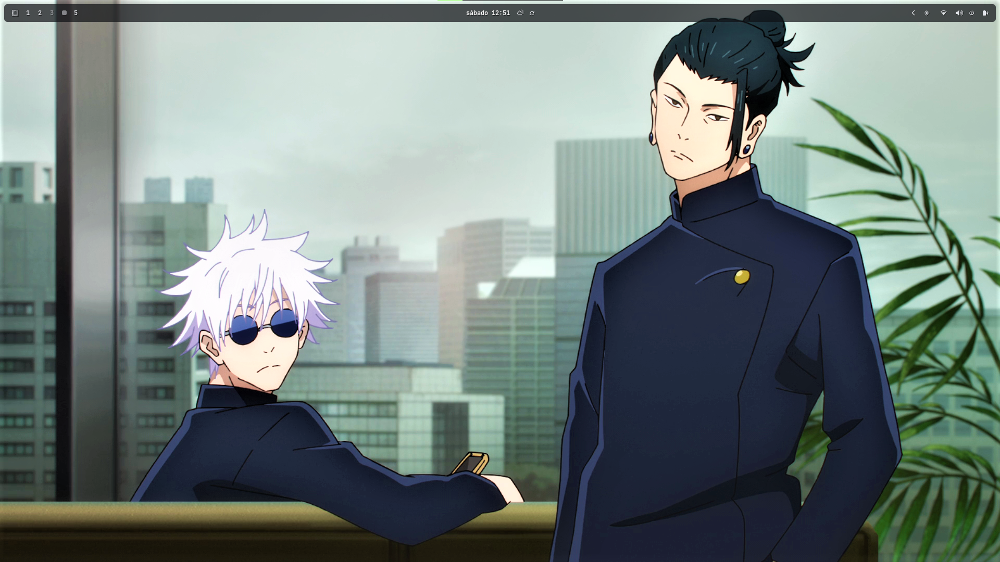

# Pure Latin

**Industrial Dark Ecosystem for Omarchy Linux**

A high-contrast, distraction-free theme built for Omarchy Linux. Engineered with a strict dark aesthetic, razor-sharp geometry, and low-fatigue terminal accents for peak focus.



---

## Features

- **Unified Industrial Palette** — Carefully matched hex codes across every window manager, panel, and TUI utility
- **Zero-Radius Geometry** — Sharp architectural lines for a clean, uniform modern layout
- **Comprehensive App Support** — Native configurations for Hyprland, Hyprlock, Waybar, Walker, Mako, Btop, Alacritty, Kitty, and Ghostty
- **Hardware Tuned** — Tailored for high-density displays and compact setups

## Color Palette

| Role      | Hex       | Description             |
| --------- | --------- | ----------------------- |
| Background| `#07080A` | Deep carbon black base  |
| Foreground| `#E2E4E9` | Crisp aluminum text     |
| Selection | `#1A1D24` | Muted charcoal highlight|
| Accent    | `#FFFFFF` | Absolute contrast white |

## Installation

```bash
omarchy-theme-install https://github.com/daurydicaprio/omarchy-pure-latin-theme
```

Activate via **Super + Space → Style → Pick new theme**.

## Hyprlock Setup

Keep your user hyprlock file intact while referencing the theme source:

```conf
source = ~/.config/omarchy/current/theme/hyprlock.conf

general {
    ignore_empty_input = true
}

background {
    monitor =
    color = $color
    path = ~/.config/omarchy/current/background
    blur_passes = 3
}

animations {
    enabled = false
}

auth {
    fingerprint:enabled = false
}
```

## Complementary Tools

- **[Live Wallpaper Manager](https://github.com/daurydicaprio/live-wallpaper-for-omarchy-linux)** — Dynamic backgrounds with sequential file numbering
- **[Omarchy Monitor Toggle](https://github.com/daurydicaprio/omarchy-monitor-toggle)** — Instant display switching and lid-close power management

## Companion Theme

Pair with [White-Man Theme](https://github.com/daurydicaprio/omarchy-white-man-theme) for day/night workflows.

---

MIT License · Created by Daury DiCaprio
